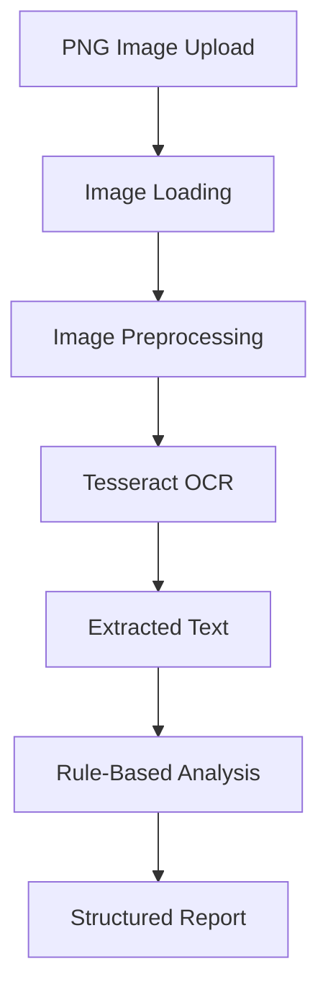
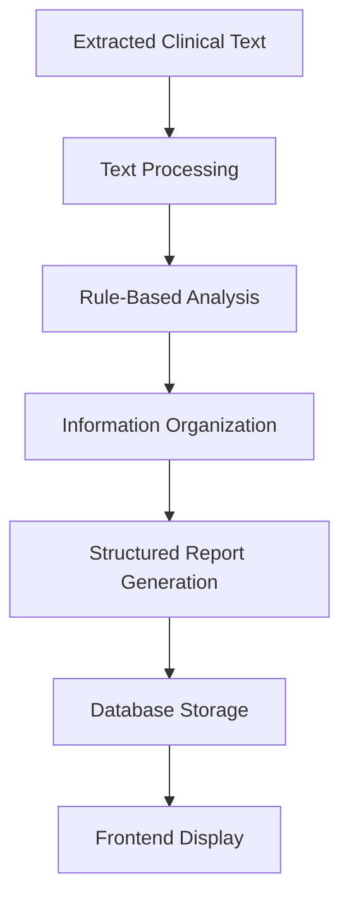

# AI/ML Design Document

## 1. Project Overview

### Project Name
AI Clinical Document Reviewer

### Objective

The objective of this project is to develop a web application that processes clinical documents and generates structured review reports.

The application supports clinical text, PDF documents, and PNG images.

It uses document processing, OCR, and rule-based analysis to extract and organize relevant clinical information.

---

## 2. AI/ML Approach

The current implementation uses a **rule-based clinical analysis engine** rather than a trained machine learning model.

The system processes clinical text and applies predefined logic to identify relevant information and generate structured review results.

OCR is used to extract text from PNG images.

### Main Components

1. Document text extraction
2. Image preprocessing and OCR
3. Rule-based clinical text analysis
4. Structured report generation
5. Persistent storage of analysis results

---

## 3. Input Processing

The system accepts three types of input.

### 3.1 Clinical Text

Users can enter clinical text directly into the application.

The text is passed to the analysis engine for processing.

### 3.2 PDF Documents

PDF documents are processed using PyMuPDF.

The extracted text is passed to the analysis engine.

### 3.3 PNG Images

PNG images are processed using Pillow and Tesseract OCR.

OCR extracts text from the image, which is then passed to the analysis engine.

---

## 4. OCR Processing

### Objective

OCR is used to convert text contained in PNG images into machine-readable text.

### Technology

- Tesseract OCR
- Pytesseract
- Pillow

### Processing Pipeline

### OCR Workflow

1. The user uploads a PNG image.
2. The backend loads the image.
3. The image is processed for text extraction.
4. Tesseract OCR extracts the text.
5. The extracted text is passed to the analysis engine.
6. The analysis engine generates a structured report.

OCR accuracy depends on image quality, text clarity, and document formatting.

---

## 5. Rule-Based Clinical Analysis

### Objective

The analysis engine identifies relevant clinical information from the extracted text and organizes it into a structured report.

### Approach

The system uses predefined rules and logic to process clinical text.

The analysis process may involve:

- Identifying relevant clinical terms.
- Extracting information from the supplied text.
- Organizing extracted information into structured sections.
- Generating a review report.

### Processing Pipeline

### Important Note

The current implementation does not use a trained machine learning model, neural network, or deep learning model for clinical analysis.

The analysis results depend on the rules implemented in the application.

---

## 6. Report Generation

The system generates a structured report from the analysis results.

The report is returned to the frontend and stored in the database.

The frontend allows users to review the generated report and download it as a PDF.

---

## 7. Data Storage

Analysis records are stored using SQLAlchemy and SQLite.

The database supports:

- Saving analysis results.
- Retrieving analysis history.
- Retrieving individual records.
- Deleting individual records.
- Clearing analysis history.

The stored results support the application's history feature.

---

## 8. Error Handling

The system handles errors that may occur during:

- Input validation
- PDF text extraction
- Image processing
- OCR text extraction
- Clinical text processing
- Database operations

Errors are returned to the frontend for display.

---

## 9. Limitations

The current implementation has the following limitations:

1. The clinical analysis engine is rule-based and does not learn from data.
2. OCR accuracy depends on image quality and text clarity.
3. The system may not correctly interpret complex clinical terminology.
4. The generated report may not capture all relevant clinical information.
5. The application is not intended to diagnose diseases or recommend treatment.
6. The system has not been established as a clinically validated medical device.

---

## 10. Future Enhancements

Possible future improvements include:

- Integrating a trained NLP model for clinical information extraction.
- Improving OCR accuracy through image preprocessing.
- Supporting additional document formats.
- Adding more advanced clinical text classification.
- Evaluating the system using a carefully prepared synthetic dataset.
- Adding stronger privacy and access-control mechanisms.

These are proposed enhancements and are not part of the current implementation.

---

## 11. Ethical and Safety Considerations

- Use synthetic clinical data for testing and demonstration.
- Do not upload real patient information without appropriate authorization and safeguards.
- Do not treat generated reports as medical advice.
- A qualified healthcare professional should independently review clinical information.

---

## 12. Conclusion

The AI Clinical Document Reviewer combines document processing, OCR, rule-based analysis, and structured report generation in a web application.

The current implementation focuses on extracting and organizing clinical information rather than making autonomous medical decisions.