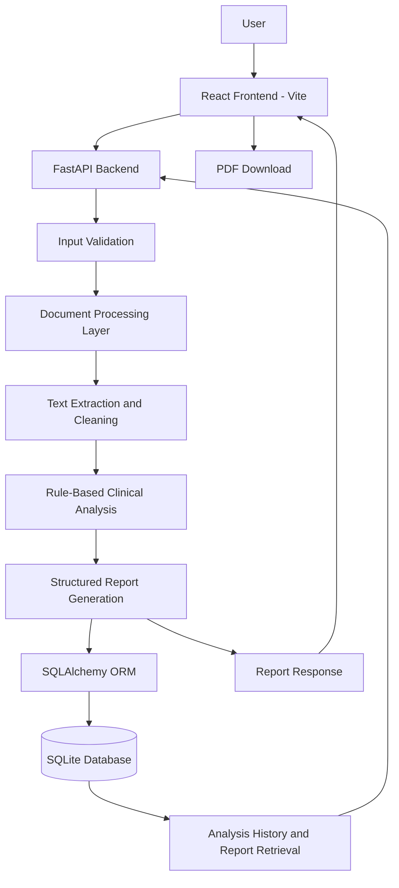

# ClinicalReview AI – System Architecture

## 1. Architecture Diagram

---

## 2. Architecture Components

### Frontend
- Built using React and Vite.
- Provides the user interface for entering clinical text and uploading files.
- Displays generated reports and analysis history.
- Allows users to download reports as PDFs.

### Backend
- Built using FastAPI.
- Receives requests from the frontend.
- Validates inputs and coordinates document processing.
- Generates structured responses and manages database operations.

### Document Processing Layer
- Processes submitted clinical text and documents.
- Extracts text from supported PDF and image files.
- Cleans extracted text before analysis.

### AI/ML Analysis Layer
- Uses rule-based clinical information analysis.
- Identifies relevant clinical information using predefined rules and patterns.
- Passes extracted information to the structured report generation process.

### Database
- Uses SQLite for persistent storage.
- SQLAlchemy ORM manages database interactions.
- Stores completed analyses and allows previously generated reports to be retrieved.

---

## 3. Application Workflow

1. The user enters clinical text or uploads a PDF or image.
2. The React frontend sends the input to the FastAPI backend.
3. The backend validates the input.
4. The document-processing layer extracts and cleans the text.
5. The rule-based analysis layer identifies relevant clinical information.
6. The backend generates a structured clinical report.
7. SQLAlchemy stores the analysis in the SQLite database.
8. The frontend displays the generated report.
9. Users can retrieve previous reports through Analysis History.
10. Users can download reports as PDFs.

---

## 4. Technology Summary

| Component | Technology |
|---|---|
| Frontend | React, Vite, JavaScript, CSS |
| Backend | Python, FastAPI |
| Document Processing | Text extraction and preprocessing |
| Analysis | Rule-based clinical analysis |
| ORM | SQLAlchemy |
| Database | SQLite |
| API Documentation | Swagger UI |