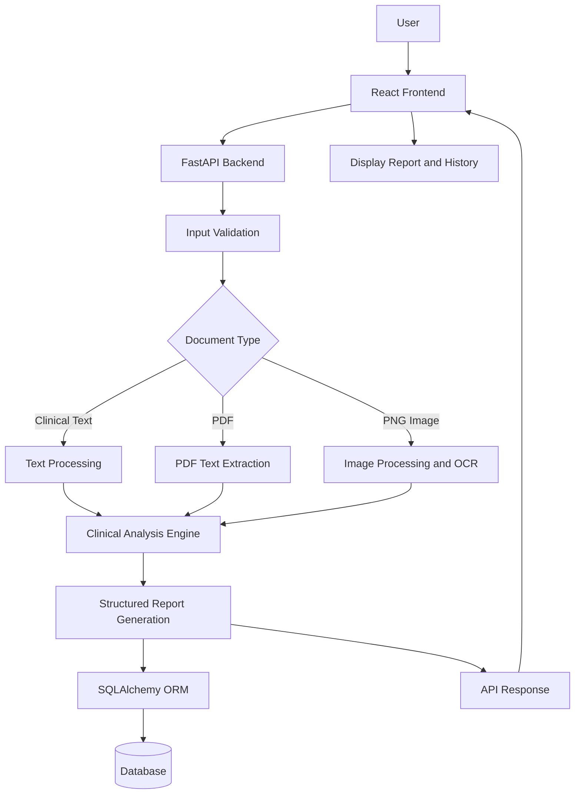
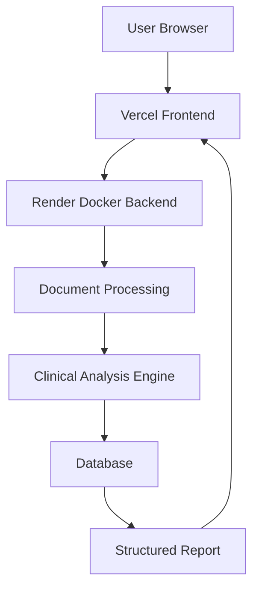

# System Architecture

## 1. Project Overview

The AI Clinical Document Reviewer is a web-based application designed to analyze clinical documents and generate structured review reports.

The application supports:
- Clinical text input
- PDF document uploads
- PNG image uploads with OCR
- Structured analysis reports
- Persistent analysis history

The system follows a frontend-backend architecture with a REST API connecting the user interface to the backend processing system.

---

## 2. High-Level Architecture

---

## 3. System Components

### 3.1 Frontend

**Technology:** React, Vite, JavaScript, CSS

Responsibilities:
- Provide the user interface.
- Accept clinical text and document uploads.
- Send requests to the backend API.
- Display structured analysis reports.
- Display analysis history.
- Support deletion of analysis records.
- Allow users to download reports as PDF.

The frontend communicates with the backend using HTTP requests.

### 3.2 Backend

**Technology:** Python and FastAPI

Responsibilities:
- Receive frontend requests.
- Validate incoming text and uploaded files.
- Process clinical text, PDFs, and PNG images.
- Extract text from supported document formats.
- Run the clinical analysis engine.
- Generate structured reports.
- Store and retrieve analysis records.
- Return responses to the frontend.

### 3.3 Document Processing

The document processing component handles different input formats.

#### Clinical Text
Text entered directly by the user is passed to the analysis engine.

#### PDF Documents
PyMuPDF is used to extract text from PDF documents.

#### PNG Images
Pillow and Tesseract OCR are used to process images and extract text.

### 3.4 Clinical Analysis Engine

The analysis engine uses rule-based logic to process extracted clinical text.

It identifies relevant information and generates structured review results.

The current implementation does not use a trained machine learning model.

### 3.5 Database Layer

**Technology:** SQLAlchemy ORM and SQLite

Responsibilities:
- Store analysis records.
- Retrieve analysis history.
- Retrieve individual analysis records.
- Delete individual records.
- Clear analysis history.

SQLAlchemy provides the database interaction layer.

---

## 4. Data Flow

### Step 1: User Input

The user enters clinical text or uploads a PDF or PNG image through the frontend.

### Step 2: API Request

The frontend sends the input to the FastAPI backend.

### Step 3: Input Validation

The backend validates the incoming request and checks the supported input format.

### Step 4: Document Processing

The backend extracts text from the supplied input.

- Text input is processed directly.
- PDF files are processed using PyMuPDF.
- PNG images are processed using Tesseract OCR.

### Step 5: Clinical Analysis

The extracted text is passed to the rule-based analysis engine.

### Step 6: Report Generation

The analysis engine produces a structured clinical review report.

### Step 7: Database Storage

The analysis result is stored in the database through SQLAlchemy.

### Step 8: Response

The backend returns the analysis result to the frontend.

### Step 9: Report Display

The frontend displays the report and updates the analysis history.

---

## 5. API Design

The application exposes REST API endpoints through FastAPI.

| Method | Endpoint | Description |
|---|---|---|
| POST | `/api/analyses/review-text` | Analyze clinical text |
| POST | `/api/analyses/review-file` | Analyze uploaded documents |
| GET | `/api/analyses` | Retrieve analysis history |
| GET | `/api/analyses/{analysis_id}` | Retrieve a specific analysis |
| DELETE | `/api/analyses/{analysis_id}` | Delete an individual analysis |
| DELETE | `/api/analyses` | Clear analysis history |

Interactive API documentation is available through Swagger UI.

---

## 6. Deployment Architecture

### Frontend Deployment

The React frontend is deployed on Vercel.

Live URL:
https://clinicalreview-ai.vercel.app/

### Backend Deployment

The FastAPI backend is deployed on Render using Docker.

Backend URL:
https://clinicalreview-ai-backend-docker.onrender.com

API documentation:
https://clinicalreview-ai-backend-docker.onrender.com/docs

### Deployment Flow

---

## 7. Error Handling

The application handles common input and processing errors, including:

- Unsupported file formats
- Invalid or corrupted documents
- Missing or unreadable document content
- OCR processing errors
- Invalid API requests

Errors are returned through the backend API and displayed to the user.

---

## 8. Security and Privacy Considerations

- Use synthetic clinical data for testing and demonstration.
- Validate uploaded files before processing.
- Avoid uploading real patient information without appropriate authorization and safeguards.
- The application is intended for educational and demonstration purposes.
- Generated reports are not a substitute for professional medical judgment.

---

## 9. Summary

The AI Clinical Document Reviewer uses a React frontend, FastAPI backend, document-processing components, a rule-based clinical analysis engine, and a database layer.

The architecture supports text, PDF, and PNG inputs and generates structured clinical review reports.